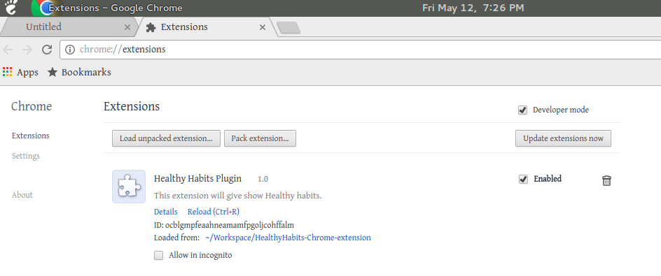
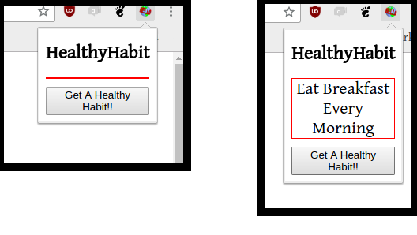

#Healthy Habits Chrome Extension

It is a Chrome Extension that gives user a healthy habit whenever he clicks on the "Get a Healthy Habit!!" button.

##Testing it out

It’s really easy to test a new extension in Chrome. Type **“chrome://extensions”** in a tab to bring up the extensions page.

Once on this page, check “Developer mode” to enable loading unpacked extensions. This will allow you to load your extension from a folder. Finally, click “Load unpacked extension” and select the extension folder to load up the extension. You should immediately see the extension show up as a Browser Action with your icon in the toolbar window of the current tab.

To test out the extension, Simple click the icon for our extension. When the HTML page comes up, click “Get a Healthy Habit!!” and you should immediately see a healthy habit being displayed.

And that’s it! If you have any problems or questions, feel free to contact. 